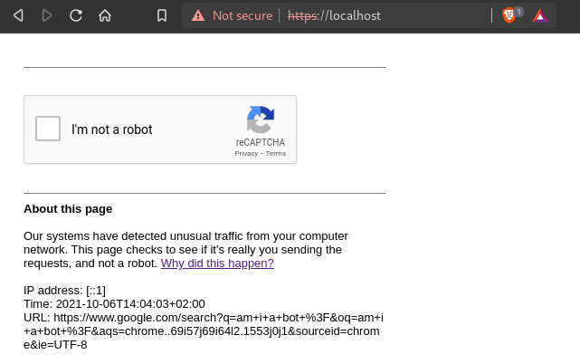

# Checkpoint

<div align="center">
    
</div>

Prevent bots from accessing your website

[](http://golang.org)  [](https://lbesson.mit-license.org/)

## Introduction

Halt ! ✋  
Checkpoint is a web access control tool.  
You must prove you're human to continue.  

## Features

* Page mimic
* reCAPTCHA v2
* Secure TLS configuration
* Simple configuration
* Cross-platform

### 🪞 Page mimic

Checkpoint mimics Google's "unsual traffic" page. It's a pretty simple page yet really effective because it should sound familiar to anyone. This is very valuable from a social engineering point of view.

<div align="center">
    
</div>

### 🤖 reCAPTCHA v2

Checkpoint relies on Google's captcha solution.

> reCAPTCHA v3 returns a score for each request without user friction. The score is based on interactions with your site and enables you to take an appropriate action for your site. - [Google's doc](https://developers.google.com/recaptcha/docs/v3)

I've face many situations where score returned by reCAPATCHA v3 was too low for humans due to a lack of interaction on the website. Since I don't find it super reliable, I've decided to use **version 2** of reCAPTCHA with the widget checkbox.

### 🔒 Secure TLS configuration

Checkpoint's TLS configuration follows the state-of-the art cryptography. It uses TLS 1.3 exclusivly with secure cipher suites :
* TLS_ECDHE_RSA_WITH_AES_256_GCM_SHA384
* TLS_ECDHE_RSA_WITH_AES_256_CBC_SHA
* TLS_RSA_WITH_AES_256_GCM_SHA384
* TLS_RSA_WITH_AES_256_CBC_SHA

### 📄 Simple configuration

Checkpoint is easily configurable through a [config file](config.json). You will need to generate a TLS certificate using [Let's Encrypt]() for example or the provided script [gen_tls_cert.sh](gen_tls_cert.sh) (⚠️ this will generate a self-signed certificate).  
The different values to configure are the following :
* certs :
  * crt : Path to TLS certificate
  * key : Path to TLS certificate private key
* recaptcha :
  * sitekey : reCAPATCHA site key
  * privatekey : reCAPTCHA private key
* redirect : 
  * success : Url to redirect to when capatcha is solved (where human go)
  * fail : Url to redirect to when capatcha has failed (where bot go)
* parameters : Required parameters in initial request. It those parameters are missing, the user will always be redirected to the fail url
* decoy : Url displayed on the html page. This is just a decoy convenient for a social engineering aspect. 

<details open>
    <summary>Here is an exemple of configuration file ⬇️</summary>

```json
{
    "certs":{
        "crt":"certs/tls.crt",
        "key":"certs/tls.key"
    },
    "recaptcha":{
        "sitekey":"XXXXXXXXXXXXXXXXXXXXXXXXXXXXXX",
        "privatekey":"YYYYYYYYYYYYYYYYYYYYYYYYYYYYYYYY"
    },
    "redirect":{
        "success":"https://google.com/",
        "fail":"https://bing.com/"
    },
    "parameters":["userid", "page"],
    "decoy":"https://www.google.com/search?q=am+i+a+bot+%3F"
}
```
</details>

### 🤝 Cross-platform

Since Checkpoint is made in Go and is using full cross-platform packages, it should run on any platform.

  
⚠️ Currently only tested on:
* Linux Fedora 34
* Kali Linux 2021.2

Feel free to test it on other platform and submit a merge request with updated [README.md](README.md).

## Installation

Clone the repo and build Checkpoint using Go.

```
git clone https://github.com/Atsika/checkpoint.git
cd checkpoint
go build
chmod +x checkpoint
```

## Usage

Once Checkpoint is built, you need to configure it through a configuration file (cf. [Simple configuration](#simple-configration)). When it's done, simply run the binary using the following command :

```
./checkpoint
```

## TODO

* Blacklist IPs
* Better logging

## License

MIT License (see [LICENSE](LICENSE)).

## Author

Made with ❤️ by Atsika ([@_atsika](https://twitter.com/_atsika))